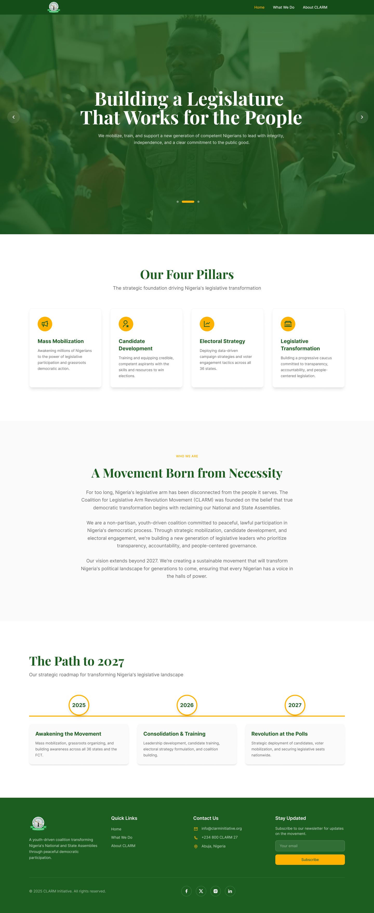
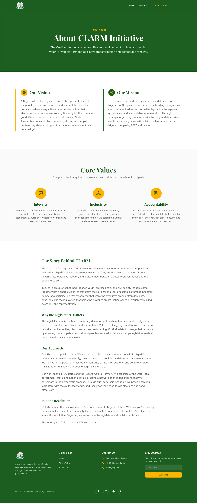
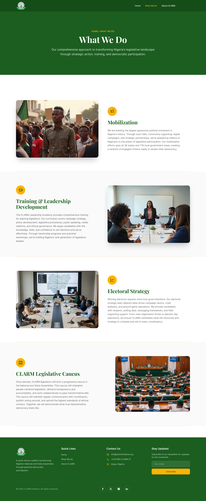
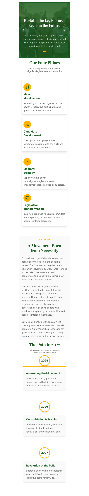
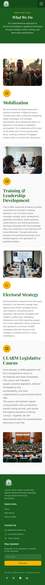
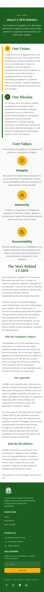

# Clarm

Clarm is a modern, responsive website built for the Clarm Initiative. The platform provides a clean and structured digital presence through a simple three-page architecture: Home, About CLARM, What We Do.

The application is built using Next.js with the App Router architecture and styled with Tailwind CSS to ensure performance, scalability, and responsiveness across all devices.

---

## Overview

This project delivers a lightweight and optimized web experience designed to clearly communicate the mission, identity, and services of the Clarm Initiative.

The website includes:

- Home Page – Introduction and overview
- About Clarm Page – Information about the initiative
- What We Do Page – Description of services and activities

---

## Project Preview

### Desktop View

#### Homepage


#### About / What We Do




### Mobile View

#### Responsive Mobile Experience






---

## Technologies Used

- Next.js (App Router)
- React
- Tailwind CSS
- Node.js

---

## Getting Started

1. Clone the Repository

```bash
git clone https://github.com/aniekan7132/clarm.git

2. Navigate into the Project Directory
cd clarm

3. Install Dependencies
npm install

4. Run Development Server
npm run dev

Open your browser and visit:
http://localhost:3000

Production Build
To create a production-ready build:

npm run build
npm start

Project Structure

This project uses the Next.js App Router architecture located inside the app/ directory for routing and layout management.

Deployment

The application is production-ready and can be deployed on any server that supports Node.js environments.